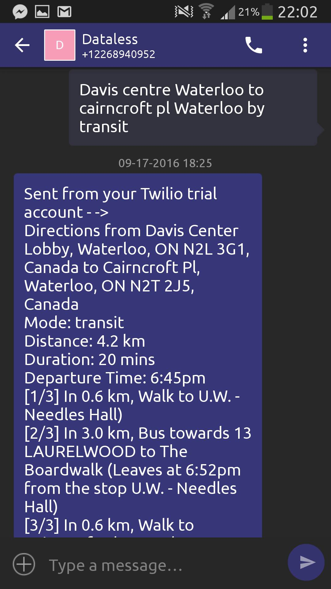

# Dataless
Data can be expensive and unavailable in some locations. Many amazing services are reliant on the use of data to provide functionality, including Yelp and Google Maps. Our goal is to enable services for dataless users. We've created a service that allows users to make use of some of these services through the use of SMS requests, using Twilio's API.

Requests are naturally phrased and parsed by the server to produce appropriate responses. In the following example, a request is sent to the server for the use of dataless navigation. The argument is parsed as a request for directions, and uses the Google Maps API to fetch directions:



Requests can also be made to the Yelp API, by prefixing the request with the command `find`:


## Run the application

1. Install the application dependencies

    ```bash
    $ dev up 
    
    # or if computer is not dev enabled, install ruby 2.3.1 and install gems
    $ bundle install
    ```

1. Export environment variables

    ```bash
    $ export TWILIO_ACCOUNT_SID=your-account-sid
    $ export TWILIO_AUTH_TOKEN=your-auth-token
    $ export TWILIO_NUMBER=your-twilio-number
    ```

  You can find `TWILIO_ACCOUNT_SID` and `TWILIO_AUTH_TOKEN` on your
  [Twilio Account Settings](https://www.twilio.com/user/account/settings).

1. Edit the administrators listed in the [config file](config/administrators.yml). _This will break the app if you don't use real phone numbers!_

1. Start the development server

    ```bash
    $ bundle exec rakeup
    ```

1. Check it out at [`http://localhost:9292`](http://localhost:9292)

That's it!

## Run the tests

1. Run tests

    ```bash
    $ bundle exec rake
    ```
